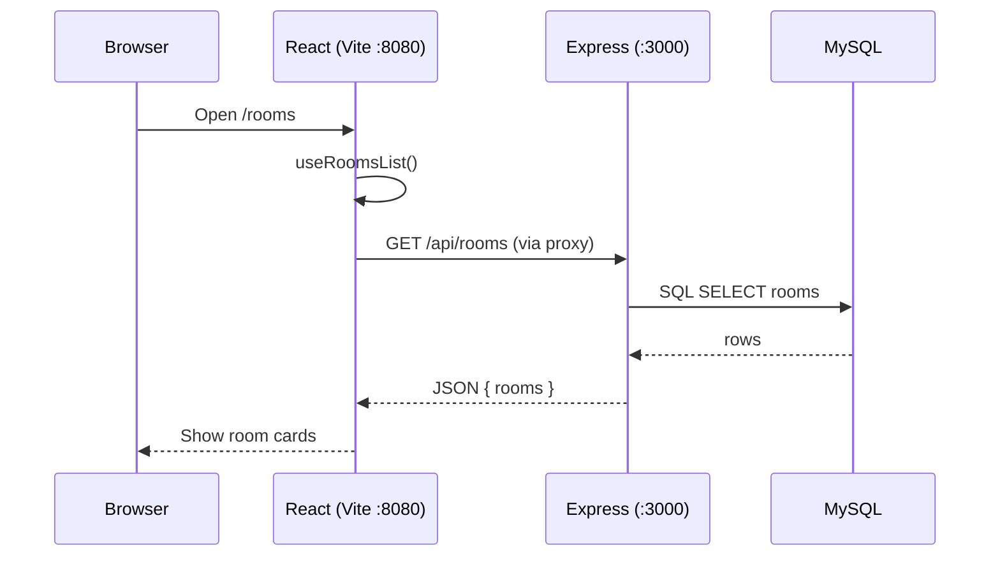

# BLOCK-JANKEN — Beginner’s guide to this project

Welcome. This document explains **what this project is**, **how the pieces fit together**, and **how to run it on your computer** — even if you are new to web development.

The app is a **rock–paper–scissors (じゃんけん) game lobby**: you can see rooms, join as a player or spectator, and view match history. It is built as a **learning project** using a very common pattern: **React** (what you see in the browser) + **Express** (the server that talks to the database) + **MySQL** (where data is stored).

---

## Table of contents

1. [What does this app do?](#1-what-does-this-app-do)
2. [Big picture: three layers](#2-big-picture-three-layers)
3. [Words you will see (glossary)](#3-words-you-will-see-glossary)
4. [Tools used in this project](#4-tools-used-in-this-project)
5. [What you need installed](#5-what-you-need-installed)
6. [First-time setup (step by step)](#6-first-time-setup-step-by-step)
7. [How to run the app every day](#7-how-to-run-the-app-every-day)
8. [What you should see in the browser](#8-what-you-should-see-in-the-browser)
9. [Folder structure explained](#9-folder-structure-explained)
10. [How data moves through the app](#10-how-data-moves-through-the-app)
11. [Pages in the app](#11-pages-in-the-app)
12. [The API (server endpoints)](#12-the-api-server-endpoints)
13. [The database](#13-the-database)
14. [Environment file (`.env`)](#14-environment-file-env)
15. [npm scripts cheat sheet](#15-npm-scripts-cheat-sheet)
16. [Common problems and fixes](#16-common-problems-and-fixes)
17. [How to study this codebase](#17-how-to-study-this-codebase)

---

## 1. What does this app do?

| Screen | URL path | What it does |
|--------|----------|----------------|
| **Home** | `/` | Dashboard: featured rooms and recent matches |
| **Lobby** | `/rooms` | List all game rooms; create a new room |
| **Room** | `/rooms/room-1006` | Play or watch a match in one room |
| **History** | `/history` | Past matches |
| **My page** | `/mypage` | Your player profile and balance |

Data (rooms, players, matches) comes from **MySQL**, not from fake data in the browser. The React app **asks the server** for that data using HTTP requests.

> **Note:** The name says “blockchain”, but this study version focuses on **React + Express + MySQL**. Wallet/blockchain features can be added later; the structure is ready for that.

---

## 2. Big picture: three layers

Think of the app as three layers stacked on top of each other:

```
┌─────────────────────────────────────────────────────────┐
│  BROWSER (what you see)                                  │
│  React app — buttons, pages, animations                  │
│  Folder: src/                                            │
│  Dev URL: http://localhost:8080                          │
└───────────────────────────┬─────────────────────────────┘
                            │  HTTP requests like GET /api/rooms
                            ▼
┌─────────────────────────────────────────────────────────┐
│  SERVER (logic + security)                               │
│  Express — receives requests, reads/writes database      │
│  Folder: server/                                         │
│  Dev URL: http://localhost:3000                          │
└───────────────────────────┬─────────────────────────────┘
                            │  SQL queries (SELECT, INSERT, …)
                            ▼
┌─────────────────────────────────────────────────────────┐
│  DATABASE (long-term storage)                            │
│  MySQL — tables: players, rooms, matches                 │
│  Often run via XAMPP on Windows                          │
└─────────────────────────────────────────────────────────┘
```

- **React** = the **frontend** (client). Runs in Chrome/Edge/Firefox.
- **Express** = the **backend** (server). Runs in **Node.js** on your PC.
- **MySQL** = the **database**. Keeps data when you close the browser.

In **development**, you usually open **port 8080** in the browser. Vite (the React tool) **forwards** `/api/...` requests to Express on port **3000**, so you do not have to configure CORS while learning.

---

## 3. Words you will see (glossary)

| Word | Simple meaning |
|------|----------------|
| **Frontend** | Code that runs in the browser (HTML/CSS/JavaScript → here: **React**). |
| **Backend** | Code that runs on a server (here: **Express** on Node.js). |
| **API** | A set of URLs the server exposes so the frontend can get or send data. Example: `GET /api/rooms` returns a list of rooms as JSON. |
| **JSON** | A text format for data, like `{"rooms": [...]}`. Browsers and servers use it a lot. |
| **REST** | A style of API: use URLs + HTTP methods (`GET`, `POST`, …) for resources. |
| **Database (DB)** | Program that stores tables of data (**MySQL** here). |
| **SQL** | Language to read/write database tables (`SELECT * FROM rooms`). |
| **Node.js** | Lets you run JavaScript on the server (not only in the browser). |
| **npm** | Tool that installs libraries and runs scripts (`npm install`, `npm run dev`). |
| **Vite** | Fast tool that builds and serves the React app during development. |
| **TypeScript** | JavaScript with types; helps catch mistakes before you run the app. |
| **Component** | A reusable piece of UI in React (e.g. a button, a page). |
| **Route** | Which URL shows which page (`/rooms` → `RoomsPage`). |
| **Hook** | A React function like `useState` or custom hooks like `useRoomsList()`. |
| **Proxy** | Vite receives `/api/...` and passes it to Express on another port. |
| **`.env`** | A file with settings (passwords, ports). Not shared on GitHub. |
| **Migration** | Creating/updating database tables from `schema.sql`. |
| **Seed** | Filling the database with sample data for testing. |

---

## 4. Tools used in this project

| Tool | Role in this project |
|------|----------------------|
| **React 19** | Builds the user interface. |
| **Vite** | Dev server for React; hot reload when you edit files. |
| **React Router** | Maps URLs to pages (`/rooms`, `/history`, …). |
| **TanStack Query** | Loads data from the API, handles loading/error/cache. |
| **Tailwind CSS** | Utility classes for styling (`text-primary`, `flex`, …). |
| **Express** | Web server for `/api/...` routes. |
| **mysql2** | Node library to connect Express to MySQL. |
| **Zod** | Checks that POST body data is valid before saving. |
| **XAMPP (optional)** | Easy way to run MySQL + phpMyAdmin on Windows. |

You do **not** need to master all of these on day one. Start with: **pages** → **`api.ts`** → **Express routes** → **database**.

---

## 5. What you need installed

### Required

1. **Node.js 18 or newer**  
   - Download: https://nodejs.org/  
   - Check in a terminal:
     ```bash
     node -v
     npm -v
     ```

2. **MySQL** (or MariaDB)  
   - **XAMPP** is a simple option on Windows: https://www.apachefriends.org/  
   - After install, start **MySQL** in the XAMPP Control Panel.

3. **A code editor**  
   - **VS Code** or **Cursor** is fine.

### Create the database (one time)

1. Open **phpMyAdmin** (often http://localhost/phpmyadmin with XAMPP).
2. Click **New** (new database).
3. Name: **`janken`**
4. Collation: **`utf8mb4_unicode_ci`**
5. Click **Create**.

The Express server will create the **tables** automatically the first time it starts.

---

## 6. First-time setup (step by step)

Open a terminal in the **project folder** (the folder that contains `package.json`).

### Step 1 — Install dependencies

Libraries used by the project are listed in `package.json`. Download them:

```bash
npm install
```

This creates a `node_modules` folder (large; do not edit it by hand).

### Step 2 — Create your `.env` file

Settings like database password live in `.env` (this file is **not** committed to Git).

**Windows (PowerShell):**

```powershell
Copy-Item .env.example .env
```

**Mac / Linux:**

```bash
cp .env.example .env
```

Open `.env` in your editor. For a typical XAMPP setup:

```env
MYSQL_HOST=127.0.0.1
MYSQL_PORT=3306
MYSQL_USER=root
MYSQL_PASSWORD=
MYSQL_DATABASE=janken

PORT=3000
VITE_API_URL=
```

- If MySQL has a **password**, put it in `MYSQL_PASSWORD=yourpassword`.
- Leave **`VITE_API_URL=`** empty so the dev proxy works (recommended for beginners).

### Step 3 — Start the app

```bash
npm run dev
```

You should see two processes start (client + api). Wait until there are no errors.

### Step 4 — Open the site

In your browser go to:

**http://localhost:8080**

If the lobby loads and you see rooms (after the server connects to MySQL), setup worked.

---

## 7. How to run the app every day

| Goal | Command |
|------|---------|
| **Normal development** (UI + API) | `npm run dev` |
| **Only the React UI** | `npm run dev:client` |
| **Only the API** | `npm run dev:server` |
| **Build for production** | `npm run build` then `npm start` → open http://localhost:3000 |

Stop the server with **Ctrl + C** in the terminal.

---

## 8. What you should see in the browser

| URL | What you should see |
|-----|---------------------|
| http://localhost:8080 | Home page with stats and room previews |
| http://localhost:8080/rooms | List of rooms; button to create a room |
| http://localhost:8080/rooms/room-1006 | Room detail (play / spectate) — use an ID from the lobby |
| http://localhost:8080/history | Match history table |
| http://localhost:8080/mypage | Player profile (default name: `Player_404`) |

**Mobile menu:** On a narrow screen, use the **☰** button in the header to open TOP / LOBBY / HISTORY / MY PAGE.

**Check the API directly:**  
http://localhost:3000/health → should show `{"ok":true}`  
http://localhost:3000/api/rooms → should show JSON with a `rooms` array.

---

## 9. Folder structure explained

```
block-janken/
│
├── README.md              ← You are here
├── package.json           ← Project name, dependencies, npm scripts
├── .env.example           ← Template for .env (copy to .env)
├── .env                   ← Your secrets (create this; not in Git)
├── index.html             ← Single HTML page; React mounts into the HTML element `<div id="root">`
├── vite.config.ts         ← Vite settings + proxy /api → Express
│
├── src/                   ★ FRONTEND (React) ★
│   ├── main.tsx           ← Starts React, routes, data-fetching library
│   ├── pages/             ← Full screens (HomePage, RoomsPage, …)
│   ├── components/        ← Reusable UI (AppShell, RoomCard, buttons, …)
│   ├── layouts/           ← Wrapper around pages (header/footer shell)
│   ├── lib/
│   │   ├── api.ts         ← fetch() calls to the server (important!)
│   │   ├── rooms-query.ts ← Hook: load rooms with caching
│   │   ├── janken-types.ts← TypeScript types (Room, Match, Hand, …)
│   │   └── player.ts      ← Your display name (from .env)
│   └── styles.css         ← Global styles + Tailwind
│
├── server/                ★ BACKEND (Express) ★
│   ├── index.ts           ← Start server, migrate DB, seed data
│   ├── app.ts             ← Wire middleware + routes + static files
│   ├── config.ts          ← Read PORT, MySQL, CORS from .env
│   ├── routes/            ← One file per API area (rooms, matches, me, …)
│   ├── repositories/      ← SQL queries (talk to MySQL)
│   ├── middleware/        ← Error handling, async helpers
│   └── db/
│       ├── schema.sql     ← CREATE TABLE statements
│       ├── pool.ts        ← Connection to MySQL
│       ├── migrate.ts     ← Run schema.sql on startup
│       └── seed.ts        ← Insert sample players/rooms if empty
│
├── docs/
│   └── STUDY.md           ← Suggested reading order for the code
│
└── dist/                  ← Built React app (after npm run build)
```

**Rule of thumb**

- Change **how it looks** → `src/pages/`, `src/components/`
- Change **what data the UI loads** → `src/lib/api.ts` + `src/lib/*-query.ts`
- Change **business rules / database** → `server/routes/` + `server/repositories/`

---

## 10. How data moves through the app

Example: opening the **Lobby** and seeing the room list.

```
1. You open /rooms in the browser.
2. RoomsPage.tsx runs and calls useRoomsList().
3. useRoomsList() uses TanStack Query to call fetchRooms() in api.ts.
4. api.ts does: fetch("/api/rooms")  →  goes to Vite on :8080
5. Vite proxy forwards the request to Express on :3000.
6. server/routes/rooms.ts handles GET /api/rooms.
7. rooms.repo.ts runs SQL: SELECT ... FROM rooms.
8. MySQL returns rows → Express sends JSON: { "rooms": [ ... ] }.
9. React receives JSON, updates the screen, shows room cards.
```

**Files to open in order when learning this flow:**

1. `src/pages/RoomsPage.tsx`
2. `src/lib/rooms-query.ts`
3. `src/lib/api.ts` → function `fetchRooms`
4. `server/routes/rooms.ts`
5. `server/repositories/rooms.repo.ts`



---

## 11. Pages in the app

| File | Route | What it loads from the API |
|------|-------|----------------------------|
| `HomePage.tsx` | `/` | `GET /api/stats/dashboard` |
| `RoomsPage.tsx` | `/rooms` | `GET /api/rooms`, `POST /api/rooms` (create) |
| `RoomDetailPage.tsx` | `/rooms/:roomId` | `GET /api/rooms/:id` |
| `HistoryPage.tsx` | `/history` | `GET /api/matches` |
| `MyAccountPage.tsx` | `/mypage` | `GET /api/me` (header: player name) |

`AppShell.tsx` wraps every page: logo, navigation, footer ticker.

**Room detail note:** Rounds in the room view are partly **simulated in the browser** for demo animations. Saving every throw to the database is a good **exercise** when you are ready (see `docs/STUDY.md`).

---

## 12. The API (server endpoints)

Base URL in development (through proxy): **`http://localhost:8080/api/...`**  
Direct to Express: **`http://localhost:3000/api/...`**

| Method | Path | Meaning |
|--------|------|---------|
| `GET` | `/health` | Server is alive |
| `GET` | `/api/rooms` | List all rooms |
| `POST` | `/api/rooms` | Create room — body: `{ "stake": 1 \| 5 \| 10, "host?", "name?" }` |
| `GET` | `/api/rooms/:id` | One room by ID |
| `GET` | `/api/matches?limit=80` | Match history |
| `GET` | `/api/me` | Current player profile + matches (send header `X-Player-Name`) |
| `GET` | `/api/stats/dashboard` | Home page data |

**HTTP methods (beginner):**

- **GET** = read data (safe, no body needed)
- **POST** = create or send data (often JSON in the body)

---

## 13. The database

MySQL stores three main tables (defined in `server/db/schema.sql`):

### `players`

| Column | Meaning |
|--------|---------|
| `name` | Player name (primary key) |
| `wallet` | Wallet address string (demo) |
| `balance` | Money balance for the UI |

### `rooms`

| Column | Meaning |
|--------|---------|
| `id` | Room ID, e.g. `room-1006` |
| `name` | Display name |
| `host` | Host player name |
| `stake` | Bet amount: 1, 5, or 10 |
| `status` | `waiting`, `playing`, or `finished` |
| `players` | JSON list of player names in the room |
| `created_at` | Timestamp |

### `matches`

Finished games: winner, loser, hands, payout, time.

On server start, `migrate()` creates tables if missing, and `seed()` adds sample data if the database is empty (including player **`Player_404`**).

---

## 14. Environment file (`.env`)

| Variable | Who reads it | What it does |
|----------|--------------|--------------|
| `MYSQL_HOST` | Express | Database server address (usually `127.0.0.1`) |
| `MYSQL_PORT` | Express | Usually `3306` |
| `MYSQL_USER` | Express | Often `root` on XAMPP |
| `MYSQL_PASSWORD` | Express | Empty or your MySQL password |
| `MYSQL_DATABASE` | Express | `janken` |
| `PORT` | Express, Vite proxy | API port (default `3000`) |
| `VITE_API_URL` | React | **Leave empty** in dev (uses proxy). For production build on same server, also empty. |
| `VITE_PLAYER_NAME` | React | Your player name; must exist in `players` table (default `Player_404`) |
| `CORS_ORIGIN` | Express | Only if you set `VITE_API_URL=http://localhost:3000` and open the UI on `:8080` |

**Important:** After changing `.env`, restart `npm run dev`.

---

## 15. npm scripts cheat sheet

| Command | What happens |
|---------|----------------|
| `npm install` | Download all libraries (first time / after pull) |
| `npm run dev` | Start React (:8080) + Express (:3000) together |
| `npm run dev:client` | Only Vite / React |
| `npm run dev:server` | Only Express API |
| `npm run build` | Compile React into `dist/` folder |
| `npm start` | Run Express in production mode (serves `dist/` + API) |
| `npm run typecheck` | Check TypeScript without running the app |
| `npm run lint` | Check code style / common mistakes |

---

## 16. Common problems and fixes

### “Cannot connect to API” / empty lobby / 接続エラー

1. Is **`npm run dev`** running (both client and api)?
2. Is **MySQL** started in XAMPP?
3. Does database **`janken`** exist in phpMyAdmin?
4. Check `.env` username/password.
5. Open http://localhost:3000/health — if this fails, the API is not running.

### Port 3000 already in use (`EADDRINUSE`)

Another program is using port 3000.

- Change in `.env`: `PORT=3001`
- Restart `npm run dev`
- If you use direct API URL, also set `VITE_API_URL=` (empty is still fine with proxy)

### CORS error in the browser console

Usually means the browser called Express directly without the proxy.

- Set **`VITE_API_URL=`** (empty) in `.env`
- Open the app at **http://localhost:8080**, not :3000
- Restart dev server

### My page shows wrong player or errors

Set in `.env`:

```env
VITE_PLAYER_NAME=Player_404
```

That name must exist in the database (created by seed).

### `npm install` fails

- Use Node 18+
- Run the terminal **as normal user** in the project folder
- On Windows, use PowerShell or Git Bash in the project directory

### I only see the logo on mobile — no menu

Tap the **☰ (menu)** button on the right of the header. Links are hidden on small screens until you open that menu.

---

## 17. How to study this codebase

Suggested order for beginners:

1. **Run the app** — follow [section 6](#6-first-time-setup-step-by-step).
2. **Click around** — home, lobby, one room, history, my page.
3. **Read one request end-to-end** — [section 10](#10-how-data-moves-through-the-app) (`GET /api/rooms`).
4. **Change something small** — e.g. text on `HomePage.tsx`, save, see hot reload.
5. **Read** [`docs/STUDY.md`](docs/STUDY.md) for exercises (new API route, new page).

**Do not try to read every file at once.** This project has many UI components (`src/components/ui/`) from a component library (shadcn). You can ignore most of them until you need a button or dialog.

---

## Quick reference card

```
Install:     npm install
Config:      copy .env.example → .env
Database:    create "janken" in phpMyAdmin, start MySQL
Run:         npm run dev
Open:        http://localhost:8080
API health:  http://localhost:3000/health
Stop:        Ctrl + C

Frontend:    src/
Backend:     server/
Data:        MySQL (players, rooms, matches)
```

---

## More help

- Deeper code walkthrough: [`docs/STUDY.md`](docs/STUDY.md)
- Backend-only notes: [`server/README.md`](server/README.md)
- Environment template: [`.env.example`](.env.example)

Good luck learning. Start small, run the app often, and trace one feature from the button you click down to the SQL query.
